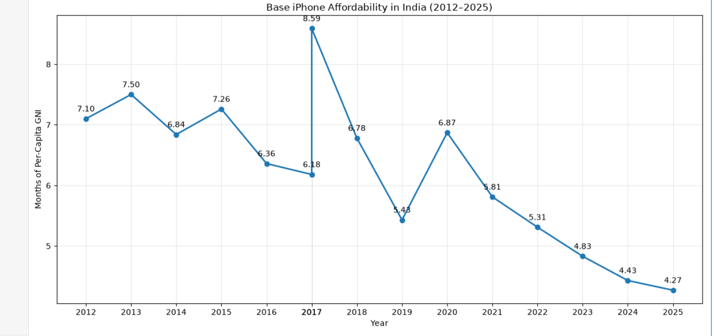
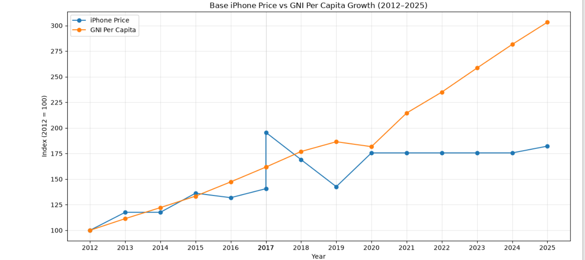
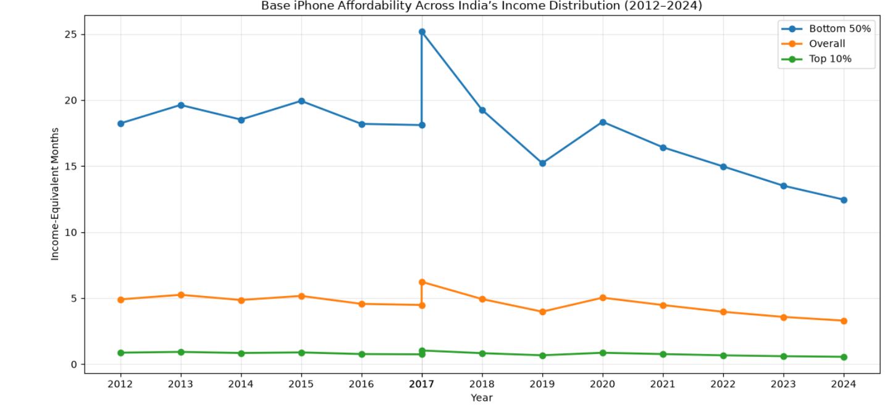
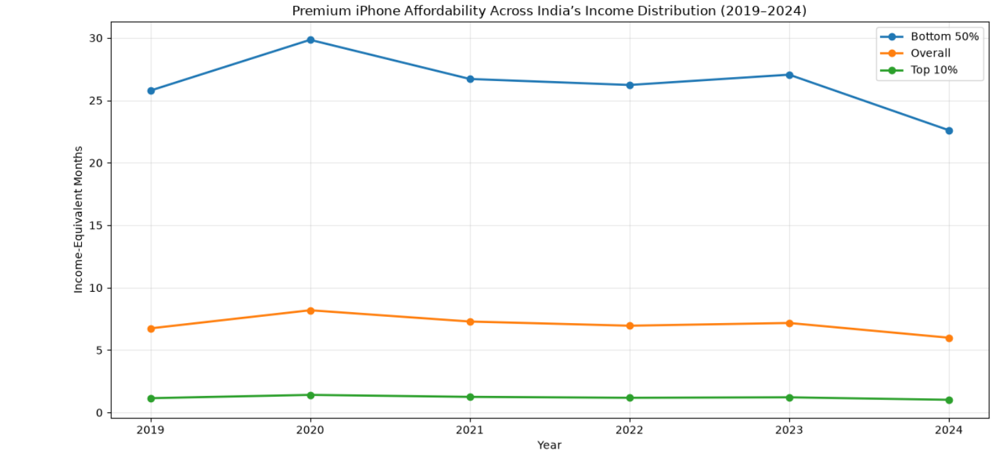
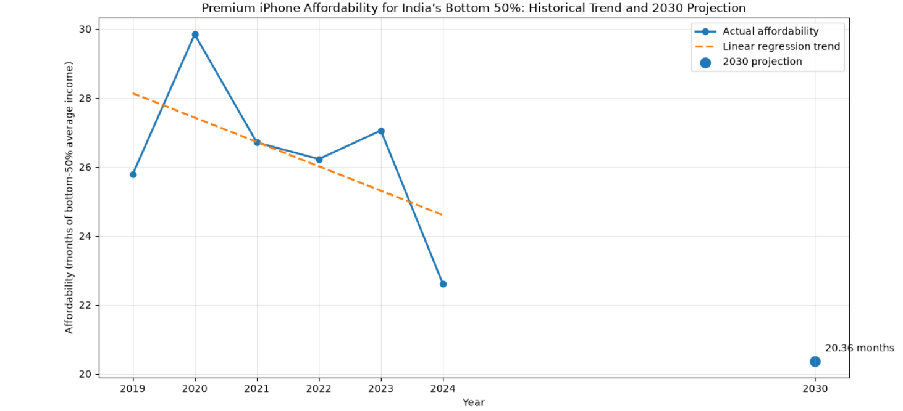

# Beyond Average: iPhone Affordability in India

I wanted to know one thing

**Has the iPhone become harder or easier to afford in India?**

The obvious way to answer it is to compare iPhone prices with India’s income per person. I did that first. But the more I looked at the result, the more I felt something was missing.

An average is a single number, and it hides how differently people actually live.

So the project grew in stages, and each stage came from a question the previous one raised.

I measure affordability in **months of income**: how many months of income the launch price of an iPhone represents. It is easy to picture, and it lets me compare very different groups on the same scale.

## Data I used

1. **World Bank:** GNI per capita for India
2. **World Inequality Database (WID):** income-distribution data, including group-average income estimates for the bottom 50% and top 10%
3. **iPhone launch prices:** Indian launch prices for base and premium models, collected by me from Apple Launch Documentation

---

## 1. The first question: Has the base iPhone become more affordable?

I started with the base iPhone and India's GNI per capita.

The answer was a surprise.

Measured against per-capita GNI, the base iPhone went from **7.10 months in 2012 to about 4.27 months in 2025**.

It got easier to afford, not harder.

The path wasn't smooth. There were spikes around **2017 and 2020**, and then the measure fell again.

But that raised another question.

## 2. Why?

### Prices vs. income growth

To understand the drop, I compared how fast iPhone prices and income grew between 2012 and 2025.

- **Base iPhone price:** up about **82.20%**
- **GNI per capita:** up about **203.24%**

Income grew more than twice as fast as the price, which helps explain the decline in the affordability measure.

But this is a national average, and GNI per capita is not anyone's salary.

That left me with the question that shaped the rest of the project:

> **Does an average tell the same story for everyone in India?**

---

## 3. Going beyond the average

To find out, I brought in income-distribution data from the **World Inequality Database (WID)** and looked at three groups:

- **Bottom 50%**
- **Overall population**
- **Top 10%**

I wanted to see what the same iPhone price looked like from different points in India's income distribution.

Here is the same base iPhone in 2024 — the iPhone 16:

| Income group | Months of income |
|---|---:|
| Bottom 50% | **12.46** |
| Overall population | **3.30** |
| Top 10% | **0.56** |

Same phone, same price.

But the relative income burden is very different across the three groups.

This is why I called the project **“Beyond Average”**: a national number can suggest that affordability is improving while the picture across the income distribution looks very different.

---

## 4. What happens at the premium end?

If the base model already shows a large difference across income groups, what happens when we move to the top of the range?

I extended the analysis to the **Pro Max models from 2019 to 2024**.

In 2024, the iPhone 16 Pro Max represented:

- **22.60 months** of bottom-50% average income
- **5.99 months** of overall average income
- **1.02 months** of top-10% average income

The gap doesn't just persist at the premium end. It becomes larger.

And that led to the next question.

---

## 5. What could happen in the future?

I wanted to take the historical analysis one step further.

If the historical trend continued, **what could premium-iPhone affordability for India's bottom 50% look like in 2030?**

I trained a linear regression model on the **2019–2024 premium-iPhone data** and used the historical relationship to create a 2030 scenario.

### How the model performed

- **MAE:** 2.13 months
- **RMSE:** 2.78 months
- **R²:** -0.56

I want to be upfront about this.

The test set had only **two observations**, and the negative R² shows that the model did not outperform a simple baseline on that test set.

I don't treat this as a reliable forecast.

I treat it as a working example of a forecasting workflow — and as a reminder of how much data a real forecast needs.

When trained on all six historical observations, the model estimates **20.36 months in 2030**.

That number is a **scenario, not a prediction**.

It answers:

> *What would affordability look like if the historical linear trend simply continued?*

Real-world changes in pricing, inflation, exchange rates, taxes, income growth, or income distribution could produce a very different result.

---

## 6. A separate case study: the 2026 foldable iPhone

Finally, I tried a what-if scenario.

The foldable iPhone is priced at **₹2,99,900**. Using a projected 2026 bottom-50% average income of about **₹78,467 a year**, that works out to roughly:

> **45.86 months of bottom-50% average income**

I kept this separate from the ML model on purpose.

The foldable is a new product category, not part of the 2019–2024 Pro Max series, so mixing it into the historical model would distort the analysis.

---

# What I took away

1. **Against national income, the base iPhone became relatively more affordable.**  
   The measure fell from 7.10 months in 2012 to 4.27 months in 2025.

2. **Income outgrew price.**  
   GNI per capita rose 203.24%, while the base iPhone price rose 82.20%.

3. **The average hides a lot.**  
   The same iPhone represents a much larger relative income burden for the bottom 50% than for the overall population or top 10%.

4. **Premium models widen the gap.**  
   In 2024, the iPhone 16 Pro Max represented 22.60 months of bottom-50% average income versus 5.99 months for the overall average.

5. **The 2030 number is a scenario, not a prediction.**  
   It rests on only six historical premium observations.

---

# Limitations

I'd rather state these clearly than have them found later.

- **GNI per capita is not salary.** It is a benchmark for national income, not what any individual earns.
- **Group incomes are averages.** The WID figures are group-average estimates, not income thresholds and not what every individual in a group earns.
- **“Bottom 50%” is a slice of the income distribution, not a social class.**
- **Affordability here ignores real life.** It does not account for expenses, savings, taxes, debt, household structure, or disposable income.
- **Prices are launch prices.** They do not reflect discounts, financing, trade-in values, or resale value.
- **The ML dataset is tiny.** Six premium observations were available for 2019–2024, with two used for testing, so metrics such as R² are unstable.
- **The forecast assumes the past continues.** That is a major assumption.
- **The foldable analysis is a separate scenario, not part of the historical ML model.**

---

# Tools

- Python
- Pandas
- Matplotlib
- Scikit-learn
- Jupyter Notebook
- GitHub
